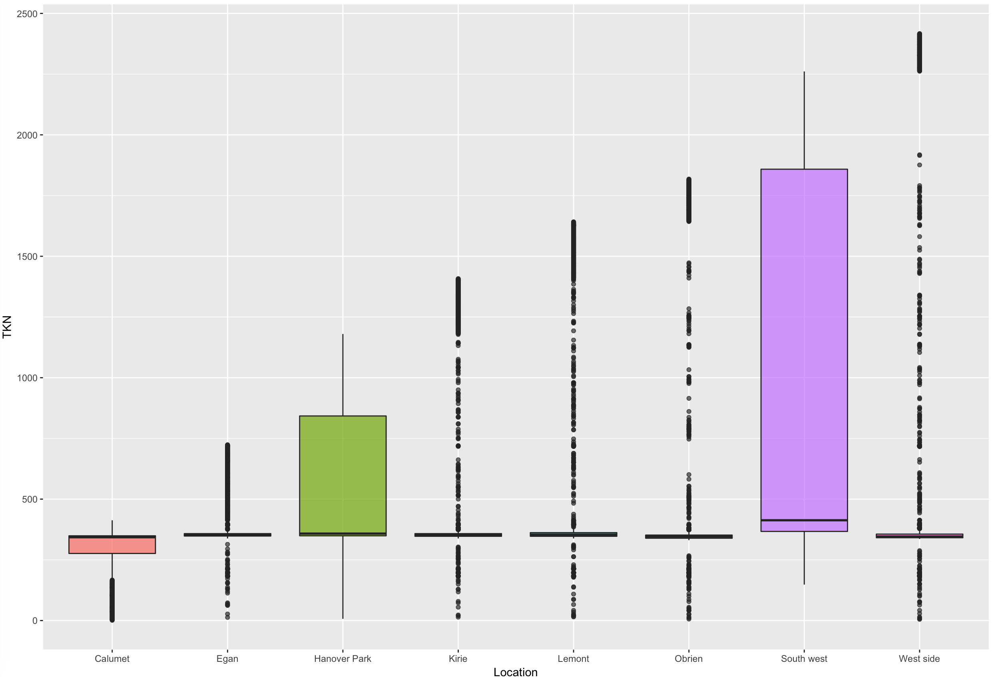
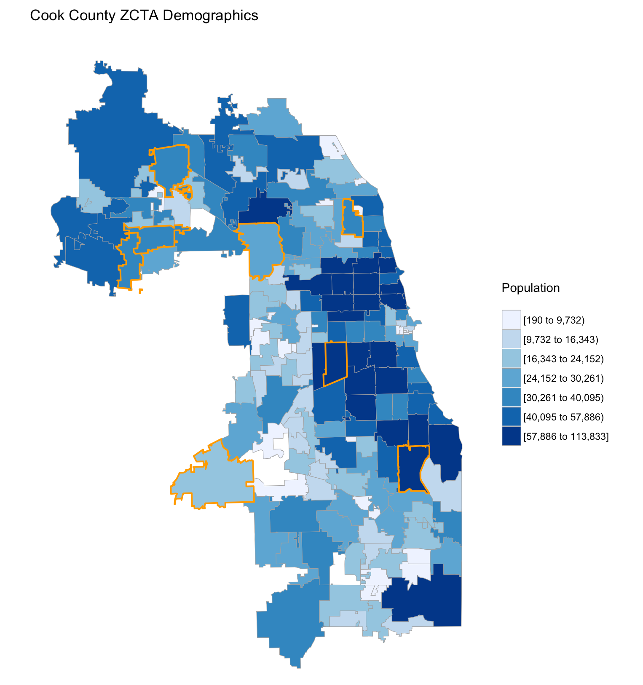

## ANOVA test on TKN

### Background information

Total Kjeldahl Nitrogen (TKN) is the U.S. EPA-approved parameter used to measure organic nitrogen and ammonia. The TKN content of influent municipal wastewater is typically between 35 and 60 mg/L(mg/kg).

###Problem definition

We want to add location of these water plants as a dummy variable. We are going to use ANOVA-test p-value approach to compare data for TKN (target variable) from the 8 waste water treatment plants to see if the means are equal. If the means are not equal, we will use dummy variables to differentiate between the waste water treatment plants. 

### Analysis steps

1. Add location as a new variable in data set. 

2. Do boxplox on TKN based on different locations and make a glance.

   

3. Set null hypothesis and alternative hypothesis 

   - $H_0: $ The mean of TKN of different location are equal.
   - $H_1: $ The mean of TKN of different location are not all equal.

4. Do ANOVA test on TKN based on different locations.

   |          | Df   | Sum Sq    | Mean Sq  | F value | Pr(>F) |
   | -------- | ---- | --------- | -------- | ------- | ------ |
   | Location | 7    | 8.199e+08 | 1.17e+08 | 690     | <2e-16 |

### Further improvement

- Many other variables such as depth increment can effect the value of TKN.
- Outliers have really high value and there might be some reasons behind.

## Demographic

### Problem defination

We've already had the zip code and address of these water plants. We want draw Cook county demographics based on zip code. The main target is to see the relationship between TKN and population distribution. 

### Analysis steps

1. Draft county map by FIP Code
2. Draw the border based on ZIP Code.
3. Find population data with ZIP Code. 
4. By the density of population, make a heat map on the original graph.

   

### Further improvement 

- Find some scale to determine the quailty of waste water. It can help us make a more accuracy conclusion since we can only determine that by the value of TKN now.
- The coordinate of each person is helpful to make a better graph.

